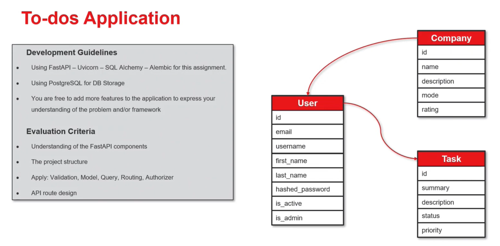
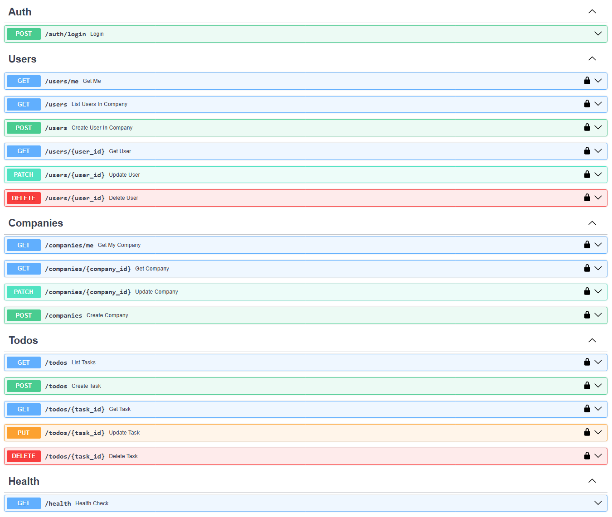

# To-dos Application
A production-ready Todo API with FastAPI, Uvicorn, SQLAlchemy ORM, Alembic migrations, and PostgreSQL.

## 📝 Overview


## 🧱 Tech Stack
- **API**: `FastAPI`, `Uvicorn`
- **DB**: `PostgreSQL`
- **ORM**: `SQLAlchemy`
- **Migrations**: `Alembic`
- **Validation**: `Pydantic`

## 📁 Project Structure
```tree
├── app
│   ├── __init__.py
│   ├── main.py
│   ├── core/
│   │   ├── __init__.py    
│   │   ├── config.py      # Configuration environment
│   │   ├── database.py    # Database connection
│   │   └── security.py    # Password hashing/JWT helpers
│   ├── models/            # SQLAlchemy models
│   │   ├── __init__.py    
│   │   ├── base.py
│   │   ├── company.py
│   │   ├── task.py
│   │   └── user.py
│   ├── routers/           # API Router
│   │   ├── __init__.py    
│   │   ├── auth.py
│   │   ├── companies.py
│   │   ├── health.py
│   │   ├── todos.py
│   │   └── users.py
│   ├── schemas/           # Pydantic models (request/response)
│   │   ├── __init__.py    
│   │   ├── company.py
│   │   ├── task.py
│   │   └── user.py
│   ├── services/          # Business logic
│   │   ├── task.py
│   │   └── auth.py        # Authentication logic with JWT
├── images/
├── venv/
├── images/                # Images for documentation
├── .env
├── .gitignore
├── requirements.txt
└── README.md
```

## 🌎 API


## ▶️ Running

### **👷 Setting up the project**

Clone the repository and navigate to its directory:

    $ git clone https://github.com/kcvdk3101/fastapi-todo-app.git
    $ cd fastapi-todo-app

### **⚙️ Setting up environment variables**

To properly configure the application, you'll need to define the following environment variables in the ```.env``` file:

- ```DB_ENGINE```: Database engine to use.
- ```DB_HOST```: Hostname of the database server.
- ```DB_PORT```: Port for the database connection.
- ```DB_USERNAME```: Username for connecting to the database.
- ```DB_PASSWORD```: Password for the database user.
- ```DB_NAME```: Name of the database.
- ```JWT_SECRET_KEY```: Secret key used to sign and verify JWT tokens.
- ```JWT_ALGORITHM```: Algorithm for signing JWTs.
- ```ACCESS_TOKEN_EXPIRE_MINUTES```: Expiration time for access tokens in minutes.

### **🐳 Seting up Docker** 
- Run/Start docker
  - Note: if received `port is already allocated` please change the another port
```bash
  # Create and run new docker with postgressql
  docker run --name fastapi-todo-app -p 5432:5432 -e POSTGRES_PASSWORD=secret -d postgres

  # Run the existed docker container
  docker start fastapi-todo-app
```
- Create PostgreSQL database
```bash
  docker exec -ti fastapi-todo-app createdb -U postgres todos_db
```
- Open PostgreSQL database in ternimal
```bash
  docker exec -ti fastapi-todo-app psql -U postgres -d todos_db
```

### **🧭 Setup Alembic**
- Initialize
```bash
  alembic init <migrations-name>
```
- Create new revision
```bash
  alembic revision -m "your message"
```
- Run upgrade migrations
```bash
  alembic upgrade <revision_id>
```
- Run downgrade migrations
```bash
  alembic downgrade <revision_id>
```
- Autogenerate migration after model changes
```bash
  alembic revision --autogenerate -m "your message"
```
- Apply all migrations
```bash
  alembic upgrade head
```

### **🚀 Start app**
- Direct to the root, then run
```bash
  python3 main.py
  # or
  python main.py
```

## 🔃 Testing

### **💡 Installation**
```bash
  pip install pytest-cov

  pytest --cov=app --cov-report=term-missing --cov-report=html --cov-report=xml
```

### **🔨 Setup `pytest.ini`**
Create pytest.ini in the root project with content:

```ini
  [pytest]
  addopts = -q --cov=app --cov-branch --cov-report=term-missing

  cov_exclude = 
      tests/*
      alembic/*
      venv/*
      .venv/*
```
Then run
```bash
  coverage run -m pytest
  coverage html
  coverage xml
  coverage report
```

## 📃 References
- [Structuring a FastAPI Project: Best Practices](https://dev.to/mohammad222pr/structuring-a-fastapi-project-best-practices-53l6)
